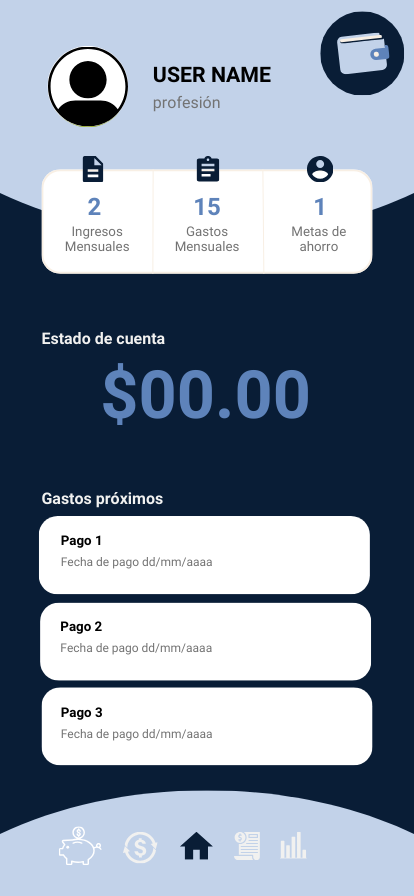
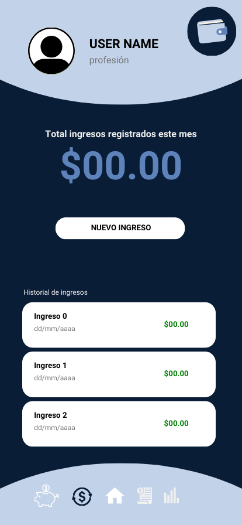
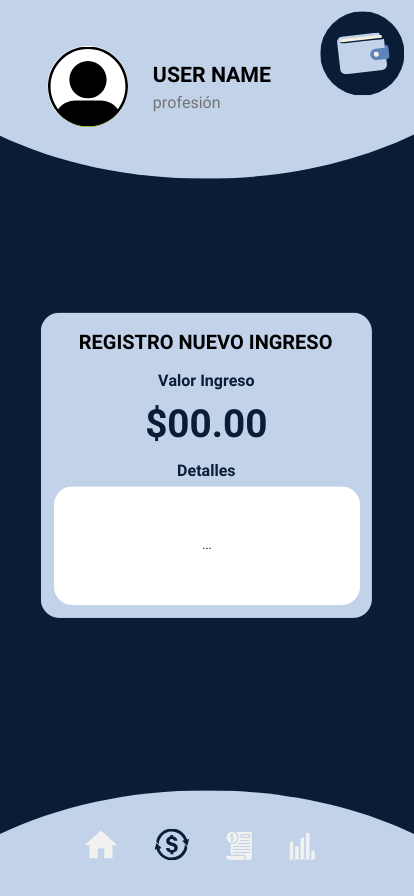
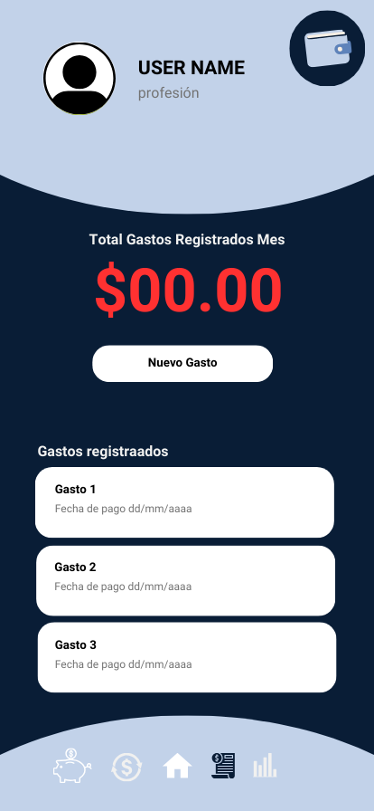
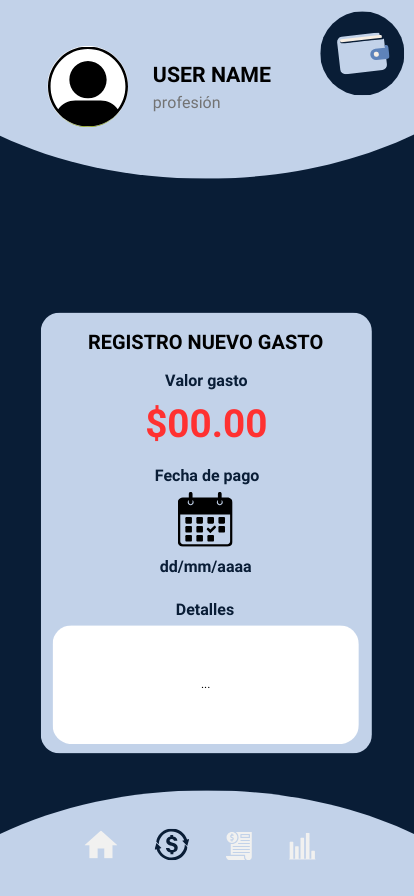
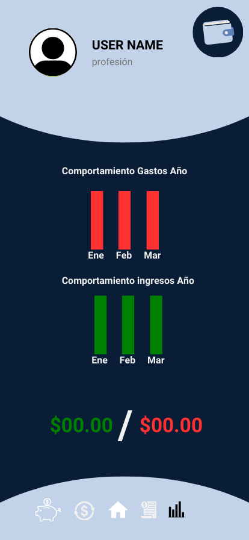
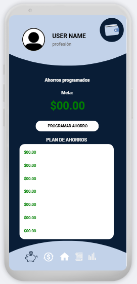
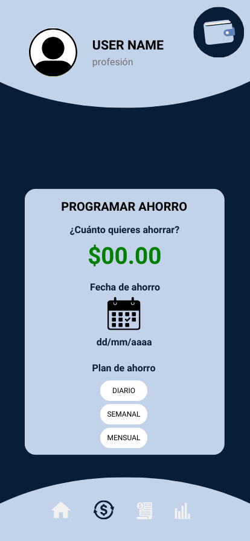

# Diseño de interfaz de usuario

La aplicación tendrá la siguientes pantallas

1. Pantalla 1: Logo

2. Pantalla 2: home

3. Pantalla 3: ingresos

4. Pantalla 4: nuevo ingreso

5. Pantalla 5: gastos

6. Pantalla 6: nuevo gasto

7. Pantalla 7: reporte

8. Pantalla 8: ahorro

9. Pantalla 9: nuevo ahorro

# Referencias

- [Material Design: Foundations](https://www.canva.com/search?q=app+prototipe)
- [Material Design: Style](https://paletasdecolores.com/paleta-de-colores-2326/)
